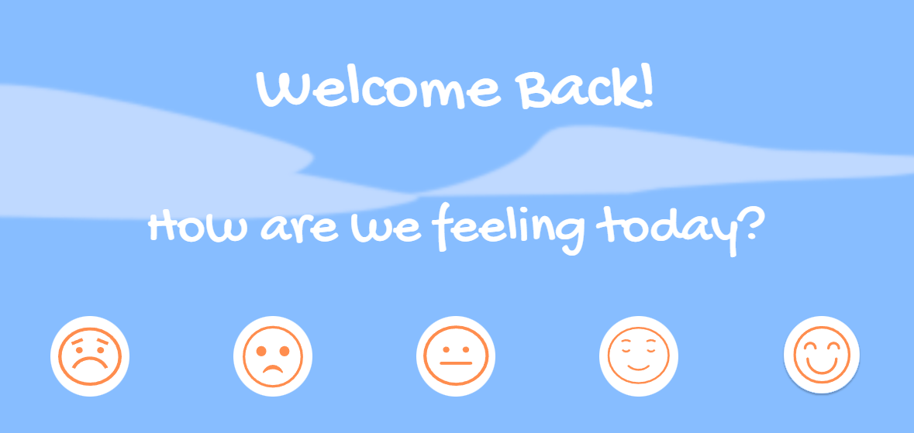
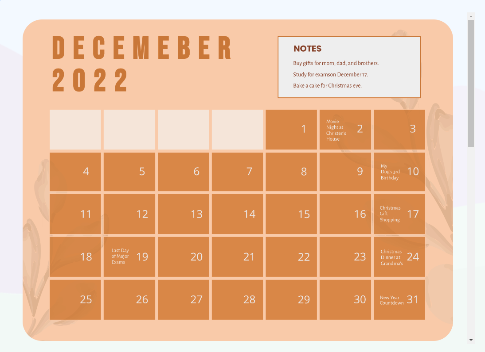
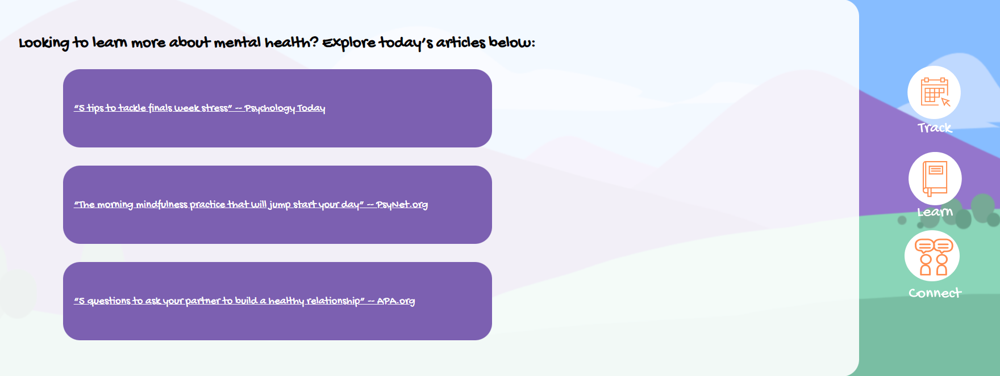

# Euda

This application was created for the HackSEA event in an attempt to provide a service for Mental Heath. In general, this application allows for the user to check-in with their feelings during the day and gives them an option to provide input to express those feelings. As users use the app, they will create a log of expressions over any period of time. In addition, the app aims to eventually provide mental health education and outlets to seek help if one is in need.

## Features and Development

As mentioned before, users will have the option to provide some input as to how they are feeling that day. The input comes in two parts, first of which is a 1-5 scale. We opted for emojis with facial expressions for the scale. 

The app will keep a log of the score given by the user as well as an optional short prompt whereby the user can provide some thoughts on their day and well-being.

The user can see a history of their logs via the calendar in what is the main page of the application. Here a user may click on the calendar to view past logs and thoughts. 

Though not currently implemented, in additon to the logs the user will receive a "gift" for checking in with themselves; the current idea is to implement a garden whereby with each day the user will receive a flower, and with each subsequent day that flower will grow in the user's garden. 

### Modals 

One the central frontend features of our application is the use of modals, we intend for the main page to be mostly empty, as we would like the garden to be the central space of the homescreen. To keep an interactive experience, we opted to use three widgets with subsequent modals for the eventual functionality. 

